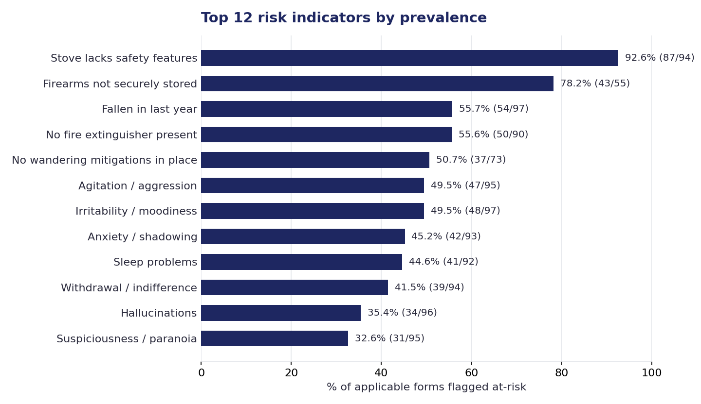
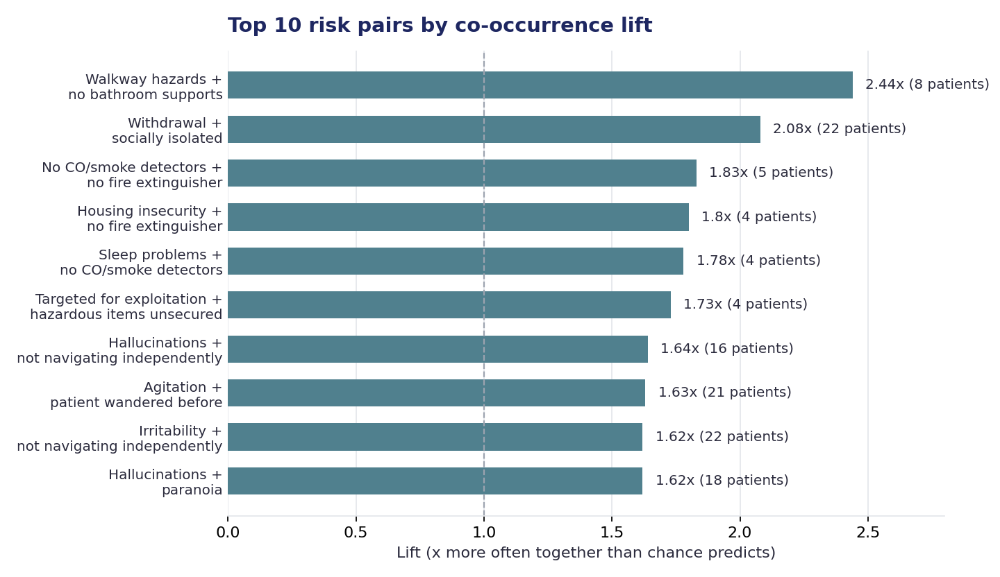
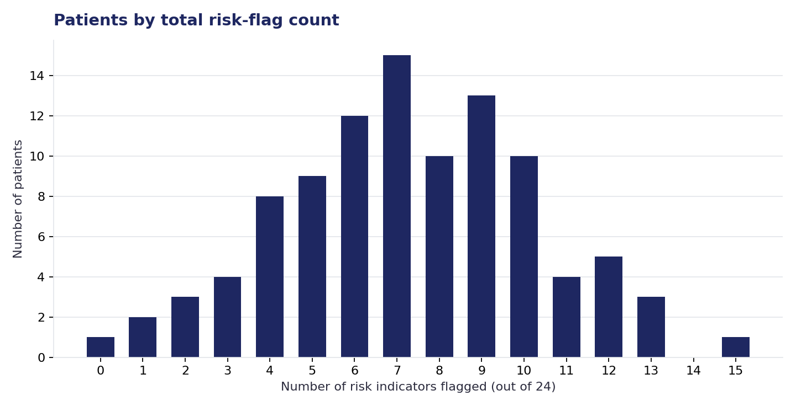

# Data-Driven Care Insights: Executive Summary

*Home Assessments & Call Intelligence — September 2026*

## Executive Summary

- 100 handwritten home-assessment forms were turned into structured, analyzable patient data.
- Clear, quantifiable risk patterns emerged across the patient population once the data was combined.
- A pilot system was built to automatically transcribe and analyze caregiver check-in calls.
- Both efforts are ready to scale, with a clear path to broader rollout.

## Home Assessments

### What we did

AvvaCare's In-Home Assessment forms are filled out by hand during every caregiver visit, capturing home safety, environment, and behavioral health. We built an automated system that reads these scanned forms and turns them into structured, searchable data — 100 forms processed so far, spanning 24 distinct safety and behavioral risk indicators per patient.

This unlocks something that wasn't possible before: looking across the entire patient population at once, instead of one paper form at a time.

### Finding 1 — A widespread, fixable gap

**93% of homes lack basic stove safety features** (safety knobs or an automatic shut-off) — the single most common pattern found across the entire group, affecting nearly every home rather than a handful of cases. Because it's so widespread, it doesn't help distinguish one patient's risk from another's, but it does point to a systemic opportunity worth addressing at scale.

The behavior-symptom indicators (agitation, irritability, anxiety, sleep problems, withdrawal) each appear in roughly 40–50% of forms — common enough to matter, but varied enough across patients to actually be useful for telling them apart.

### Finding 2 — Patterns that cluster together

Some risk indicators show up together far more often than chance alone would predict. **Withdrawal and social isolation co-occur in 22 patients — about twice the rate expected by chance** — the largest such pattern by patient count, suggesting a specific, identifiable group rather than two unrelated, scattered issues. **Walkway hazards and missing bathroom supports co-occur even more strongly (2.44x expected)** in a smaller group of 8 homes, indicating these two safety gaps tend to appear together within the same home.

These are the kinds of patterns that are easy to miss reading forms one at a time, and easy to see once the data is combined.

### Finding 3 — Patients aren't all alike

Each patient's assessment was scored against 24 possible risk indicators. The spread shown above — most patients clustered in the middle, with some much higher or lower — is what makes a composite count like this useful: it can meaningfully separate patients from one another, rather than labeling everyone the same way.

## Call Intelligence

### What we did

We also piloted a system that automatically transcribes and analyzes caregiver check-in calls with patients and families — flagging emotional distress, key concerns, and calls that need urgent follow-up, without anyone having to listen to every recording. It even works across languages: non-English calls are translated alongside the original so any reviewer can verify what was flagged and why.

### Early results (pilot stage)

- **Strong initial quality** — tested on an initial set of sample calls, with accurate transcription and sentiment scoring.
- **Automatic concern detection** — flags distress level and specific concerns (e.g. financial stress, safety, caregiver burnout), plus calls needing urgent review.
- **Works across languages** — non-English calls are translated for easy verification by any reviewer.

This is still pilot-stage: the next step is validating the pipeline on a larger batch of calls before broader rollout.

## Where We Go From Here

1. Expand the home-assessment pipeline as new forms come in.
2. Validate the call-intelligence pipeline on a larger batch of calls.
3. Use these structured signals to support care prioritization going forward.
